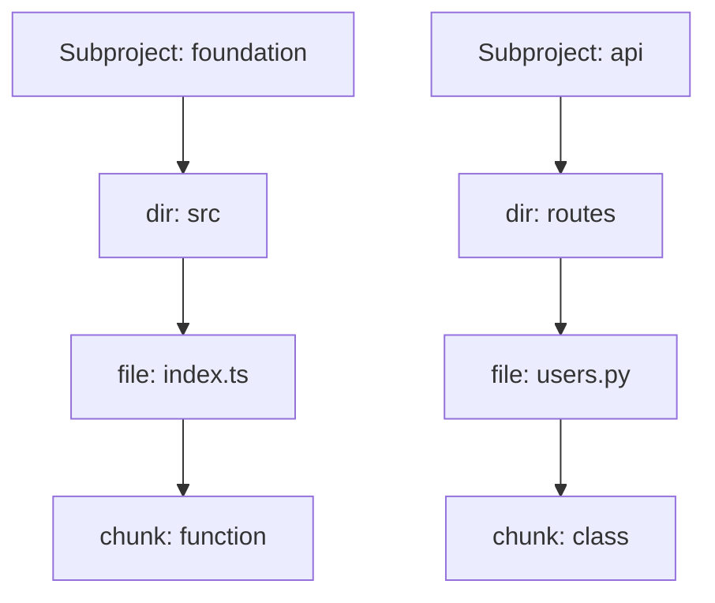

# Multi-Root Visualization Architecture Research

**Date:** 2025-02-16
**Researcher:** Claude Code Research Agent
**Objective:** Analyze monorepo detection and visualization architecture to plan multi-root visualization support

---

## Executive Summary

The codebase already has **comprehensive monorepo detection** and **subproject tracking** infrastructure in place. The visualization system creates **subproject root nodes** and tracks subproject membership for all chunks. However, the **KG visualization endpoint does NOT leverage this monorepo infrastructure** — it currently builds a single-root graph without considering subproject boundaries.

### Key Findings

1. **Monorepo Detection is Fully Implemented** - `monorepo.py` provides robust subproject detection
2. **Chunks Track Subproject Membership** - All code chunks store `subproject_name` and `subproject_path`
3. **Chunk Graph Uses Subprojects** - `/api/graph` endpoint creates multi-root subproject nodes
4. **KG Graph Ignores Subprojects** - `/api/kg-graph` endpoint doesn't use subproject structure
5. **Recommended Approach** - Replicate chunk graph's multi-root architecture in KG visualization

---

## 1. Monorepo Detection (`src/mcp_vector_search/utils/monorepo.py`)

### Architecture

The `MonorepoDetector` class provides comprehensive monorepo detection:

```python
class Subproject(NamedTuple):
    """Represents a subproject in a monorepo."""
    name: str              # "ewtn-plus-foundation"
    path: Path             # Absolute path to subproject
    relative_path: str     # Relative to monorepo root
```

### Detection Methods

**Priority Order (first match wins):**

1. **NPM Workspaces** - `package.json` with `workspaces` field
2. **Lerna Packages** - `lerna.json` with `packages` array
3. **PNPM Workspaces** - `pnpm-workspace.yaml`
4. **Nx Workspace** - `nx.json` or `workspace.json` (scans `apps/`, `libs/`, `packages/`)
5. **Fallback** - Multiple `package.json` files (excludes test/docs directories)

### Exclusion Rules

Directories excluded from subproject detection:

```python
EXCLUDED_SUBPROJECT_DIRS = {
    "tests", "test", "examples", "example", "docs", "doc",
    "scripts", "tools", "benchmarks", "benchmark",
    "node_modules", ".git", ".github", ".gitlab",
    "build", "dist", "__pycache__", ".pytest_cache",
    ".mypy_cache", ".ruff_cache", "coverage", ".coverage", "htmlcov"
}
```

### API Methods

| Method | Purpose | Returns |
|--------|---------|---------|
| `is_monorepo()` | Check if project is monorepo | `bool` |
| `detect_subprojects()` | Get all subprojects | `list[Subproject]` |
| `get_subproject_for_file(file_path)` | Find subproject containing file | `Subproject \| None` |

### Integration Points

**Used by:**
- `core/indexer.py` - Creates `MonorepoDetector` instance during indexing
- `core/chunk_processor.py` - Assigns subproject metadata to chunks during processing

**Subproject Assignment:**

```python
# In chunk_processor.py
subproject = self.monorepo_detector.get_subproject_for_file(file_path)
if subproject:
    chunk.subproject_name = subproject.name
    chunk.subproject_path = subproject.relative_path
```

---

## 2. Chunk Data Structure (`src/mcp_vector_search/core/models.py`)

### CodeChunk Schema

```python
@dataclass
class CodeChunk:
    # Core identification
    chunk_id: str
    file_path: str
    content: str

    # Monorepo support
    subproject_name: str | None = None  # "ewtn-plus-foundation"
    subproject_path: str | None = None  # "packages/foundation"

    # AST structure
    chunk_type: str                     # function, class, method
    function_name: str | None
    class_name: str | None
    parent_chunk_id: str | None

    # Metadata
    start_line: int
    end_line: int
    language: str
    complexity_score: int
    # ... more fields
```

### Storage

**Vector Database Fields:**

```python
# In lancedb_backend.py
{
    "chunk_id": chunk.chunk_id,
    "file_path": chunk.file_path,
    "subproject_name": chunk.subproject_name or "",
    "subproject_path": chunk.subproject_path or "",
    # ... other fields
}
```

**Retrieval:**

```python
# Chunks returned from database include subproject metadata
chunk = CodeChunk(
    subproject_name=row.get("subproject_name") or None,
    subproject_path=row.get("subproject_path") or None,
    # ... other fields
)
```

---

## 3. Chunk Graph Visualization (`/api/graph` endpoint)

### Current Multi-Root Implementation

**File:** `src/mcp_vector_search/cli/commands/visualize/graph_builder.py`

#### Subproject Root Nodes

```python
# In build_graph_data()
async def build_graph_data(chunks, database, project_manager, code_only=False):
    # Collect subprojects from chunks
    subprojects = {}
    for chunk in chunks:
        if chunk.subproject_name and chunk.subproject_name not in subprojects:
            subprojects[chunk.subproject_name] = {
                "name": chunk.subproject_name,
                "path": chunk.subproject_path,
                "color": get_subproject_color(chunk.subproject_name, len(subprojects))
            }

    # Add subproject root nodes
    if subprojects:
        for sp_name, sp_data in subprojects.items():
            node = {
                "id": f"subproject_{sp_name}",
                "name": sp_name,
                "type": "subproject",
                "file_path": sp_data["path"] or "",
                "color": sp_data["color"],
                "depth": 0
            }
            nodes.append(node)
```

#### Hierarchy Construction



**Link Types:**

1. **subproject_containment** - Subproject → Top-level chunks
2. **dir_containment** - Directory → Subdirectories/Files
3. **file_containment** - File → Chunks
4. **chunk_hierarchy** - Class → Methods

#### Color Coding

```python
def get_subproject_color(subproject_name: str, index: int) -> str:
    colors = [
        "#238636",  # Green
        "#1f6feb",  # Blue
        "#d29922",  # Yellow
        "#8957e5",  # Purple
        "#da3633",  # Red
        "#bf8700",  # Orange
        "#1a7f37",  # Dark green
        "#0969da",  # Dark blue
    ]
    return colors[index % len(colors)]
```

#### Metadata Structure

```json
{
  "nodes": [...],
  "links": [...],
  "metadata": {
    "total_chunks": 1234,
    "total_files": 56,
    "languages": {"python": 30, "typescript": 26},
    "is_monorepo": true,
    "subprojects": ["ewtn-plus-foundation", "ewtn-plus-api"]
  }
}
```

---

## 4. KG Visualization (`/api/kg-graph` endpoint)

### Current Implementation

**File:** `src/mcp_vector_search/cli/commands/visualize/server.py`

```python
@app.get("/api/kg-graph")
async def get_kg_graph_data() -> Response:
    """Get knowledge graph data for D3 force-directed visualization."""
    kg_graph_file = viz_dir / "kg-graph.json"

    if not kg_graph_file.exists():
        return Response(
            content='{"error": "KG graph data not found", "nodes": [], "links": []}',
            status_code=404
        )

    with open(kg_graph_file, "rb") as f:
        data = orjson.loads(f.read())

    return Response(
        content=orjson.dumps({
            "nodes": data.get("nodes", []),
            "links": data.get("links", [])
        })
    )
```

### KG Data Generation

**File:** `src/mcp_vector_search/core/knowledge_graph.py`

```python
async def get_visualization_data(self) -> dict[str, Any]:
    """Export knowledge graph data for D3.js visualization."""
    nodes = []

    # Get all code entities as nodes
    entity_result = self.conn.execute("""
        MATCH (e:CodeEntity)
        RETURN e.id AS id,
               e.name AS name,
               e.entity_type AS type,
               e.file_path AS file_path
    """)

    # Map entity types to color groups
    type_to_group = {
        "file": 1,
        "module": 2,
        "class": 3,
        "function": 4,
        "method": 5
    }

    for record in entity_result:
        nodes.append({
            "id": record["id"],
            "name": record["name"],
            "type": record["type"],
            "file_path": record["file_path"],
            "group": type_to_group.get(record["type"], 0)
        })

    # Get relationships
    links = []
    rel_result = self.conn.execute("""
        MATCH (a:CodeEntity)-[r]->(b:CodeEntity)
        RETURN a.id AS source,
               b.id AS target,
               label(r) AS type
    """)

    for record in rel_result:
        links.append({
            "source": record["source"],
            "target": record["target"],
            "type": record["type"]
        })

    return {"nodes": nodes, "links": links}
```

### Current Limitations

**NO Monorepo Support:**
- Does NOT query for `Project` entities
- Does NOT filter by subproject boundaries
- Does NOT create subproject root nodes
- Does NOT include subproject metadata in nodes
- Builds flat entity graph without project structure

**Entity Types in KG:**

```python
# From knowledge_graph.py
@dataclass
class CodeEntity:
    id: str                    # Unique identifier (chunk_id)
    name: str                  # Display name
    entity_type: str           # file, class, function, module
    file_path: str             # Source file path
    commit_sha: str | None = None

@dataclass
class Project:
    id: str                    # "project:<name>"
    name: str                  # Project name
    description: str = ""
    repo_url: str = ""
```

**Project Entity Exists But NOT Used:**

```python
# Project entity is defined but not queried in get_visualization_data()
class Project:
    """A project node representing the codebase in the knowledge graph."""
    id: str          # project:<name>
    name: str
    description: str = ""
    repo_url: str = ""
```

---

## 5. KG Builder (`src/mcp_vector_search/core/kg_builder.py`)

### Project Entity Creation

**NOT Currently Creating Project Entities:**

Search for "Project" in kg_builder.py returns NO matches for project entity creation. The builder focuses on:

1. **CodeEntity** - Functions, classes, methods
2. **DocSection** - Documentation chunks
3. **Tag** - Topic clustering
4. **Commit** - Git history tracking
5. **Branch** - Version control

**Potential Integration Point:**

```python
async def build_from_database(self, database, show_progress=True):
    """Build graph from all chunks in database."""

    # Current: Extracts entities from chunks
    for chunk in chunks:
        # Create CodeEntity for functions/classes
        entity = CodeEntity(
            id=chunk.chunk_id,
            name=chunk.function_name or chunk.class_name,
            entity_type=chunk.chunk_type,
            file_path=chunk.file_path
        )
        await self.kg.add_entity(entity)

    # MISSING: Create Project entities for subprojects
    # This would need to be added
```

### Relationship Types

**Current KG Relationships:**

```python
@dataclass
class CodeRelationship:
    source_id: str         # Caller entity ID
    target_id: str         # Callee entity ID
    relationship_type: str # CALLS, IMPORTS, EXTENDS, CONTAINS
    commit_sha: str | None = None
```

**Relationship Types:**
- **CALLS** - Function calls function
- **IMPORTS** - Module imports module
- **EXTENDS** - Class extends class
- **CONTAINS** - File contains class/function

**MISSING Relationship:**
- **BELONGS_TO** - Entity belongs to Project/Subproject

---

## 6. Recommended Approach for Multi-Root KG Visualization

### Option A: Mirror Chunk Graph Architecture (Recommended)

**Rationale:** Chunk graph already has working multi-root visualization with subproject support.

#### Implementation Steps

1. **Modify `get_visualization_data()` to include subproject grouping:**

```python
async def get_visualization_data(self, subproject_filter: str | None = None):
    """Export KG data with subproject support."""

    # Step 1: Collect unique subprojects from entities
    subproject_map = {}
    entity_result = self.conn.execute("""
        MATCH (e:CodeEntity)
        RETURN DISTINCT e.file_path AS file_path
    """)

    # Detect subprojects from file paths (use MonorepoDetector)
    from ..utils.monorepo import MonorepoDetector
    detector = MonorepoDetector(project_root)

    for record in entity_result:
        file_path = Path(record["file_path"])
        subproject = detector.get_subproject_for_file(file_path)
        if subproject:
            subproject_map[subproject.name] = {
                "name": subproject.name,
                "path": subproject.relative_path,
                "color": get_subproject_color(subproject.name, len(subproject_map))
            }

    # Step 2: Create subproject root nodes
    nodes = []
    if subproject_map:
        for sp_name, sp_data in subproject_map.items():
            nodes.append({
                "id": f"subproject_{sp_name}",
                "name": sp_name,
                "type": "subproject",
                "file_path": sp_data["path"],
                "group": 0,  # Root level
                "color": sp_data["color"]
            })

    # Step 3: Add entity nodes with subproject metadata
    entity_result = self.conn.execute("""
        MATCH (e:CodeEntity)
        RETURN e.id AS id,
               e.name AS name,
               e.entity_type AS type,
               e.file_path AS file_path
    """)

    for record in entity_result:
        file_path = Path(record["file_path"])
        subproject = detector.get_subproject_for_file(file_path)

        node = {
            "id": record["id"],
            "name": record["name"],
            "type": record["type"],
            "file_path": record["file_path"],
            "group": type_to_group.get(record["type"], 1)
        }

        # Add subproject metadata
        if subproject:
            node["subproject"] = subproject.name
            node["color"] = subproject_map[subproject.name]["color"]

        nodes.append(node)

    # Step 4: Add links (existing relationships)
    links = []
    rel_result = self.conn.execute("""
        MATCH (a:CodeEntity)-[r]->(b:CodeEntity)
        RETURN a.id AS source,
               b.id AS target,
               label(r) AS type
    """)

    for record in rel_result:
        links.append({
            "source": record["source"],
            "target": record["target"],
            "type": record["type"]
        })

    # Step 5: Add subproject→entity containment links
    if subproject_map:
        for node in nodes:
            if node.get("subproject"):
                links.append({
                    "source": f"subproject_{node['subproject']}",
                    "target": node["id"],
                    "type": "subproject_containment"
                })

    return {
        "nodes": nodes,
        "links": links,
        "metadata": {
            "is_monorepo": len(subproject_map) > 0,
            "subprojects": list(subproject_map.keys())
        }
    }
```

2. **Update `/api/kg-graph` endpoint to regenerate with subproject support:**

```python
@app.get("/api/kg-graph")
async def get_kg_graph_data(subproject: str | None = None) -> Response:
    """Get KG data with optional subproject filtering."""

    # Check if KG file exists
    kg_graph_file = viz_dir / "kg-graph.json"

    # OPTION 1: Regenerate on-demand (slower but always fresh)
    from mcp_vector_search.core.knowledge_graph import KnowledgeGraph
    kg = KnowledgeGraph(project_root / ".mcp-vector-search" / "knowledge_graph.db")
    await kg.initialize()
    data = await kg.get_visualization_data(subproject_filter=subproject)

    # OPTION 2: Load cached file (faster but may be stale)
    # with open(kg_graph_file, "rb") as f:
    #     data = orjson.loads(f.read())

    return Response(
        content=orjson.dumps({
            "nodes": data["nodes"],
            "links": data["links"],
            "metadata": data.get("metadata", {})
        })
    )
```

3. **Update D3 visualization to handle subproject nodes:**

```javascript
// In D3 force-directed graph rendering
const simulation = d3.forceSimulation(nodes)
    .force("link", d3.forceLink(links).id(d => d.id))
    .force("charge", d3.forceManyBody().strength(-100))
    .force("center", d3.forceCenter(width / 2, height / 2))
    .force("collision", d3.forceCollide().radius(d => {
        // Larger radius for subproject roots
        return d.type === "subproject" ? 30 : 10;
    }));

// Color nodes by subproject or entity type
node.attr("fill", d => {
    if (d.type === "subproject") return d.color;
    if (d.subproject) return subprojectColorMap[d.subproject];
    return typeColorMap[d.type];
});

// Size nodes by type
node.attr("r", d => {
    if (d.type === "subproject") return 20;  // Largest
    if (d.type === "file") return 8;
    if (d.type === "class") return 6;
    return 4;  // Functions/methods
});
```

### Option B: Create Project Entities in KG (More Complex)

**Rationale:** Store subproject structure directly in knowledge graph for persistent querying.

#### Implementation Steps

1. **Add Project entity creation to kg_builder.py:**

```python
async def build_from_database(self, database, show_progress=True):
    """Build graph with Project entities for monorepo support."""

    # Detect subprojects
    from ..utils.monorepo import MonorepoDetector
    detector = MonorepoDetector(self.project_root)
    subprojects = detector.detect_subprojects()

    # Create Project entities
    for subproject in subprojects:
        project = Project(
            id=f"project:{subproject.name}",
            name=subproject.name,
            description=f"Subproject at {subproject.relative_path}",
            repo_url=""
        )
        await self.kg.add_project(project)

    # Process chunks and link to projects
    for chunk in chunks:
        subproject = detector.get_subproject_for_file(Path(chunk.file_path))

        # Create CodeEntity
        entity = CodeEntity(
            id=chunk.chunk_id,
            name=chunk.function_name or chunk.class_name,
            entity_type=chunk.chunk_type,
            file_path=chunk.file_path
        )
        await self.kg.add_entity(entity)

        # Create BELONGS_TO relationship
        if subproject:
            await self.kg.conn.execute("""
                MATCH (e:CodeEntity {id: $entity_id}),
                      (p:Project {id: $project_id})
                CREATE (e)-[:BELONGS_TO]->(p)
            """, {"entity_id": entity.id, "project_id": f"project:{subproject.name}"})
```

2. **Query Project entities in visualization:**

```python
async def get_visualization_data(self):
    """Export KG with Project nodes."""
    nodes = []

    # Add Project nodes
    project_result = self.conn.execute("""
        MATCH (p:Project)
        RETURN p.id AS id,
               p.name AS name,
               p.description AS description
    """)

    for record in project_result:
        nodes.append({
            "id": record["id"],
            "name": record["name"],
            "type": "project",
            "group": 0
        })

    # Add CodeEntity nodes
    entity_result = self.conn.execute("""
        MATCH (e:CodeEntity)
        RETURN e.id AS id,
               e.name AS name,
               e.entity_type AS type,
               e.file_path AS file_path
    """)

    for record in entity_result:
        nodes.append({
            "id": record["id"],
            "name": record["name"],
            "type": record["type"],
            "file_path": record["file_path"],
            "group": type_to_group.get(record["type"], 1)
        })

    # Get relationships including BELONGS_TO
    links = []
    rel_result = self.conn.execute("""
        MATCH (a)-[r]->(b)
        WHERE (a:CodeEntity OR a:Project) AND (b:CodeEntity OR b:Project)
        RETURN a.id AS source,
               b.id AS target,
               label(r) AS type
    """)

    for record in rel_result:
        links.append({
            "source": record["source"],
            "target": record["target"],
            "type": record["type"]
        })

    return {"nodes": nodes, "links": links}
```

**Trade-offs:**

| Aspect | Option A (Mirror Chunk Graph) | Option B (KG Project Entities) |
|--------|-------------------------------|--------------------------------|
| **Complexity** | Low - reuse existing patterns | High - modify KG schema |
| **Performance** | Fast - compute on-demand | Slower - requires KG rebuild |
| **Persistence** | No - computed per request | Yes - stored in KG database |
| **Query Power** | Limited - file path matching | Rich - Kuzu graph queries |
| **Maintenance** | Easy - minimal changes | Moderate - KG schema changes |
| **Consistency** | Always fresh | May be stale until rebuild |

---

## 7. Key Files to Modify

### For Option A (Recommended)

| File | Changes Required |
|------|------------------|
| `src/mcp_vector_search/core/knowledge_graph.py` | Modify `get_visualization_data()` to detect subprojects from file paths and add subproject root nodes |
| `src/mcp_vector_search/cli/commands/visualize/server.py` | Optional: Regenerate KG data on-demand with subproject support (or keep cached) |
| `src/mcp_vector_search/cli/commands/visualize/templates/kg-visualization.html` | Update D3 visualization to render subproject roots with larger nodes and color coding |

### For Option B (More Complex)

| File | Changes Required |
|------|------------------|
| `src/mcp_vector_search/core/knowledge_graph.py` | Add `add_project()` method, update schema |
| `src/mcp_vector_search/core/kg_builder.py` | Detect subprojects and create Project entities during build |
| `src/mcp_vector_search/core/knowledge_graph.py` | Modify `get_visualization_data()` to query Project entities |
| `src/mcp_vector_search/cli/commands/visualize/templates/kg-visualization.html` | Update D3 visualization to render project nodes |

---

## 8. Current Data Flow

### Chunk Graph (Already Multi-Root)

```
Index Command
    ↓
MonorepoDetector.detect_subprojects()
    ↓
ChunkProcessor assigns subproject_name/path to chunks
    ↓
Chunks stored in vector DB with subproject metadata
    ↓
/visualize command reads chunks from DB
    ↓
build_graph_data() creates subproject root nodes
    ↓
chunk-graph.json contains multi-root structure
    ↓
/api/graph serves multi-root data
    ↓
D3 tree visualization renders multiple roots
```

### KG Graph (Currently Single-Root)

```
Index Command
    ↓
KGBuilder extracts entities from chunks (ignores subproject metadata)
    ↓
CodeEntity nodes created without project links
    ↓
Knowledge graph stored in Kuzu database
    ↓
/wiki or /visualize command generates kg-graph.json
    ↓
get_visualization_data() queries CodeEntity (no Project entities)
    ↓
kg-graph.json contains flat entity structure
    ↓
/api/kg-graph serves single-root data
    ↓
D3 force-directed graph renders flat structure
```

---

## 9. Implementation Recommendations

### Immediate Next Steps (Option A)

1. **Test MonorepoDetector on sample monorepo**
   - Verify subproject detection works for npm/lerna/pnpm workspaces
   - Validate `get_subproject_for_file()` returns correct subproject

2. **Modify `get_visualization_data()` to detect subprojects**
   - Add subproject detection from entity file paths
   - Create subproject root nodes
   - Add subproject metadata to entity nodes
   - Create containment links

3. **Update `/api/kg-graph` endpoint**
   - Regenerate KG data on-demand (or keep cached with metadata)
   - Return subproject structure in response

4. **Update D3 visualization frontend**
   - Handle subproject nodes in force-directed layout
   - Color code by subproject
   - Size nodes by hierarchy level

### Future Enhancements (Option B)

1. **Add Project entity to KG schema**
   - Extend `knowledge_graph.py` with `add_project()` method
   - Update Kuzu schema to include Project nodes

2. **Modify KGBuilder to create Project entities**
   - Detect subprojects during indexing
   - Create Project entities before processing chunks
   - Link CodeEntity → Project via BELONGS_TO relationship

3. **Query Project entities in visualization**
   - Update Cypher queries to include Project nodes
   - Filter entities by project

4. **Add project-level analytics**
   - Project-level complexity metrics
   - Inter-project dependency graph
   - Project health dashboards

---

## 10. Conclusion

**Current State:**
- ✅ Monorepo detection infrastructure fully implemented
- ✅ Chunks track subproject membership in vector DB
- ✅ Chunk graph visualization supports multi-root structure
- ❌ KG graph visualization ignores subproject structure

**Recommended Path:**
- **Short-term:** Option A (mirror chunk graph architecture) - fastest path to multi-root KG visualization
- **Long-term:** Option B (KG Project entities) - enables rich project-level queries and analytics

**Key Insight:**
The hardest parts (monorepo detection, subproject tracking) are already implemented. Adding multi-root support to KG visualization is primarily a **data transformation task** rather than a major architectural change.

**Next Steps:**
1. Modify `get_visualization_data()` to compute subproject grouping
2. Update `/api/kg-graph` endpoint to regenerate with subproject support
3. Update D3 force-directed graph to render subproject roots

**Estimated Effort:**
- Option A: 4-6 hours (modify 3 files, test on sample monorepo)
- Option B: 16-24 hours (modify KG schema, rebuild KG, update queries, test extensively)

---

## Appendix: Sample Data Structures

### Chunk Graph Multi-Root Node

```json
{
  "id": "subproject_ewtn-plus-foundation",
  "name": "ewtn-plus-foundation",
  "type": "subproject",
  "file_path": "packages/foundation",
  "start_line": 0,
  "end_line": 0,
  "complexity": 0,
  "color": "#238636",
  "depth": 0
}
```

### Chunk with Subproject Metadata

```json
{
  "id": "chunk_abc123",
  "name": "calculateTotal",
  "type": "function",
  "file_path": "packages/foundation/src/utils/math.ts",
  "subproject": "ewtn-plus-foundation",
  "subproject_path": "packages/foundation",
  "color": "#238636",
  "start_line": 42,
  "end_line": 58,
  "complexity": 3
}
```

### Desired KG Multi-Root Structure

```json
{
  "nodes": [
    {
      "id": "subproject_foundation",
      "name": "ewtn-plus-foundation",
      "type": "subproject",
      "file_path": "packages/foundation",
      "group": 0,
      "color": "#238636"
    },
    {
      "id": "entity_calculateTotal",
      "name": "calculateTotal",
      "type": "function",
      "file_path": "packages/foundation/src/utils/math.ts",
      "subproject": "ewtn-plus-foundation",
      "group": 4,
      "color": "#238636"
    }
  ],
  "links": [
    {
      "source": "subproject_foundation",
      "target": "entity_calculateTotal",
      "type": "subproject_containment"
    }
  ],
  "metadata": {
    "is_monorepo": true,
    "subprojects": ["ewtn-plus-foundation", "ewtn-plus-api"]
  }
}
```
